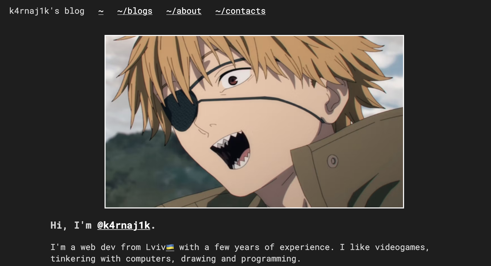
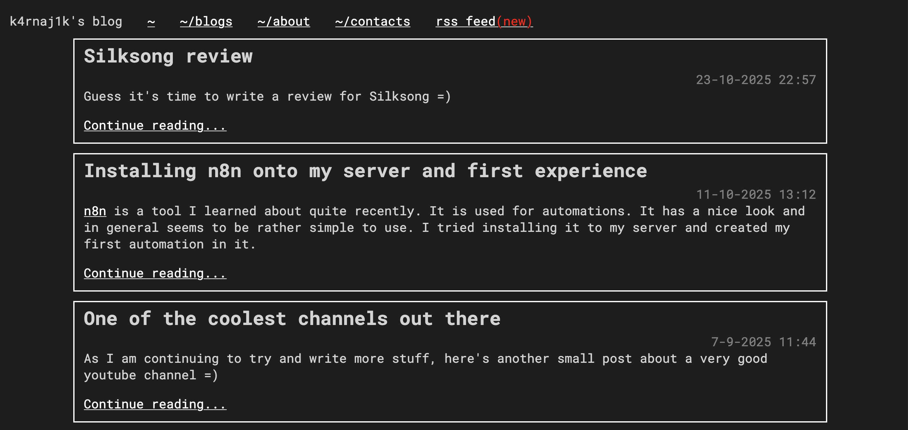

# nextjs markdown blog

A simple blogging application that takes in `config.json` file and renders markdown files in `blog-pages` folder.



> Doesn't include any form of editing/uploads/auth. This app is supposed to be very simple, all editing is supposed to be done via external apps, such as `Obsidian`, `Filebrowser` or others.



## Example config.json
```json
{
  "blogName": "k4rnaj1k's blog",
  "author": "Vlad @k4rnaj1k",
  "authorEmail": "k4rnaj1k@k4rnaj1k.space",
  "aboutPage": "some description or file link",
  "blogsFolder": "./blog-pages",
  "domain": "https://localhost:3000",
  "contacts": {
    "changeme": "https://localhost:3000/blogs/placeholder"
  }
}
```

Some of those props are used for generating rss feed.